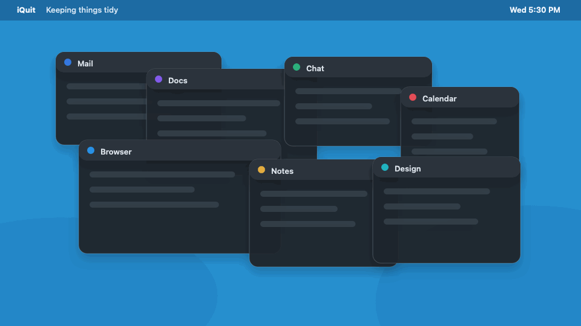
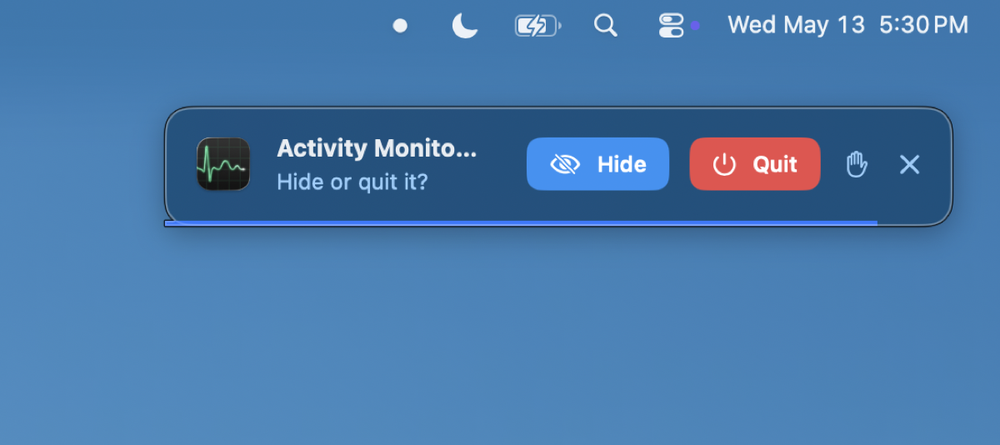
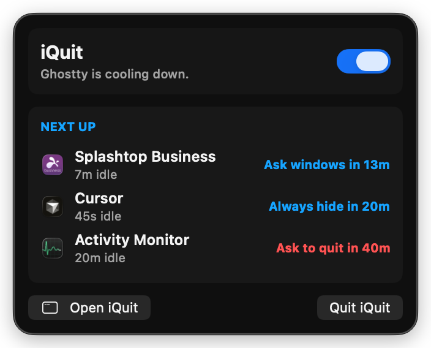
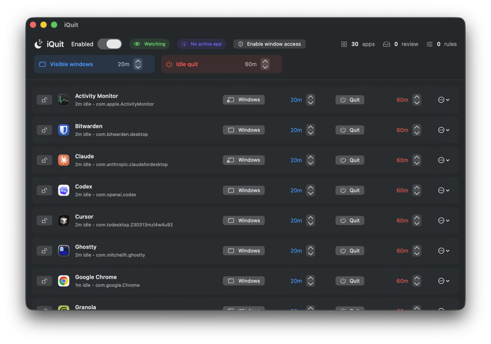

<table>
  <tr>
    <td width="280">
      
    </td>
    <td>
      <h1>iQuit</h1>
      <p>iQuit is a tiny macOS menu bar app that hides or quits apps you are no longer using.</p>
      <p><strong><a href="https://github.com/intelc/iquit/releases/latest/download/iQuit.dmg">Download iQuit.dmg</a></strong></p>
      <p>Requires macOS 14 or newer. iQuit is a native Mac app and does not support Windows.</p>
    </td>
  </tr>
</table>

It keeps your desktop calmer by checking for apps that are just sitting around, then asks before it hides their windows or quits them. It is open source, native SwiftUI, and conservative by default.



## Get iQuit

Download the latest notarized DMG from the link above, then drag `iQuit.app` into Applications and launch it. The first launch explains the two cleanup systems and asks whether you want to enable optional Window Access.

## Why iQuit

iQuit is for the everyday Mac problem where apps stay open long after they stopped being useful.

- Keeps old windows from piling up on your desktop
- Quits forgotten background apps without force quitting them
- Lets you protect apps that should never be touched
- Uses stable per-app rules based on bundle identifiers
- Works quietly from the menu bar
- Uses a native, small, readable UI

## How It Works

iQuit has two cleanup systems:

- **Visible Windows**: if an inactive app still has windows on screen after 20 minutes, iQuit asks whether to Hide or Quit.
- **Idle Quit**: if a background app stays idle after 1 hour, iQuit asks whether to Quit.

You can change the defaults globally or per app. Set Idle Quit to **Never** for apps that should stay open, or use **Protect** to make iQuit ignore an app completely.

When iQuit asks, it uses a small floating prompt with a countdown bar. Hide keeps the app running; Quit asks the app to close politely.



## Safety

iQuit does not force quit apps. A quit request is the same polite system-level quit apps normally receive, so apps with unsaved work can still show their own prompts.

iQuit asks before cleanup by default. If you ignore, skip, or time out a prompt, that app enters a short cooldown so it will not immediately ask again. Protected apps are never hidden or quit automatically.

Window Access is optional. When granted, iQuit can minimize individual windows. Without it, Hide falls back to hiding the whole app.

## Screenshots

The menu bar popover shows the next apps likely to need attention, without listing everything on your Mac.



The dashboard keeps the two cleanup systems separate: blue for visible-window cleanup, red for idle quit.



## Features

- Native SwiftUI menu bar app
- CoreGraphics visible-window detection
- Foreground app tracking with `NSWorkspace`
- Per-bundle rules
- 30-second review prompts
- 10-minute cooldown after ignored or skipped prompts
- Accessibility-backed per-window minimize when Window Access is granted
- Developer ID signed and notarized DMG

## Codex Prompts

Sanitized Codex transcripts for the project are available in [`prompts/index.md`](prompts/index.md). The combined export lives at [`prompts/all-iquit-codex-prompts.md`](prompts/all-iquit-codex-prompts.md), with per-session files in [`prompts/sessions/`](prompts/sessions/).

## Run From Source

```sh
swift run iQuit
```

For permission-sensitive testing, prefer the signed bundle flow below. macOS privacy grants attach to the app bundle identity, so repeatedly launching raw command-line binaries is less stable for TCC.

## Stable Signed Bundle

```sh
cp Config/iQuit.local.xcconfig.example Config/iQuit.local.xcconfig
./Scripts/launch_bundle.sh
```

Edit `Config/iQuit.local.xcconfig` if you want a different stable bundle identifier. The default local signing path uses ad-hoc signing (`CODE_SIGN_IDENTITY = -`) and launches the same `.build/iQuit.app` bundle path each time, mirroring Mosspath Lite's source-build TCC flow.

## Build a DMG

```sh
./Scripts/build-dmg.sh
```

The packaged disk image is written to `.build/iQuit.dmg`.

## Notarized Release

Developer ID signing and notarization follow the same pattern as Mosspath's release pipeline: ignored local signing config, Developer ID + hardened runtime, a signed DMG, `notarytool --wait`, stapling, then Gatekeeper validation against both the DMG and the app inside it.

In-app updates use Sparkle 2 with a signed appcast and DMG assets hosted on
GitHub Releases. See [`docs/RELEASE_WORKFLOW.md`](docs/RELEASE_WORKFLOW.md)
for the local release script and checklist.

Create `Config/iQuit.local.xcconfig`:

```xcconfig
DEVELOPMENT_TEAM = YOUR_TEAM_ID
IQUIT_BUNDLE_IDENTIFIER = com.yourname.iquit
IQUIT_VERSION = 0.1.5
IQUIT_BUILD_NUMBER = 6
IQUIT_APPCAST_URL = https://github.com/intelc/iquit/releases/latest/download/appcast.xml
SPARKLE_PUBLIC_ED_KEY = public-key-from-sparkle-generate_keys
CODE_SIGN_IDENTITY = Developer ID Application: Your Name (YOUR_TEAM_ID)
NOTARY_KEYCHAIN_PROFILE = iquit-notary
```

Store notarization credentials in the macOS keychain. This can be an Apple ID app-specific password or an App Store Connect API key profile:

```sh
xcrun notarytool store-credentials iquit-notary --team-id YOUR_TEAM_ID
```

Then build, submit, staple, and validate:

```sh
./Scripts/build-dmg.sh
./Scripts/notarize-dmg.sh
```

Generate a signed Sparkle appcast after notarization:

```sh
./Scripts/generate-appcast.sh
```

For a complete release, run:

```sh
./Scripts/release-local.sh 0.1.6
```

CI can use the Mosspath-style fallback environment variables instead of a keychain profile: `APPLE_ID`, `APPLE_APP_SPECIFIC_PASSWORD`, and `APPLE_TEAM_ID`.

## Roadmap

- Launch at login
- Import and export rules
- Accessibility-powered window rules for known clutter windows
- Learning mode for repeated manual cleanup
- Optional local classification on Apple Intelligence-compatible Macs, used only to suggest rules

## License

MIT
